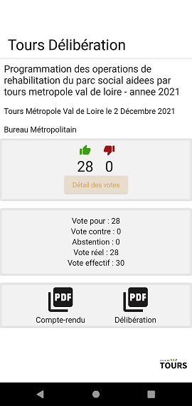
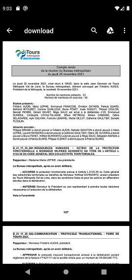

## L\'application

Tours Délibérations vous permet de consulter les délibérations du Conseil et du Bureau Métropolitain de Tours Métropole Val de Loire.

## Screen

## Libraries

* [Jetpack Compose](https://developer.android.com/jetpack/compose) & [Navigation Compose](https://developer.android.com/jetpack/compose/navigation)
* Navigation-Animation ([Google accompanist](https://github.com/google/accompanist/tree/main/navigation-animation))
* [Retrofit](https://square.github.io/retrofit/)
* [Timber](https://github.com/JakeWharton/timber)

## Data

[Délibérations - Tours Métropole Val de Loire](https://data.tours-metropole.fr/explore/dataset/deliberations-tours-metropole-val-de-loire/information/?sort=delib_date)

## License

Copyright 2021 Yoann Le Taillanter

Licensed under the Apache License, Version 2.0 (the "License"); you may not use this file except in compliance with the License. You may obtain a copy of the License at http://www.apache.org/licenses/LICENSE-2.0
Unless required by applicable law or agreed to in writing, software distributed under the License is distributed on an "AS IS" BASIS, WITHOUT WARRANTIES OR CONDITIONS OF ANY KIND, either express or implied. See the License for the specific language governing permissions and limitations under the License.